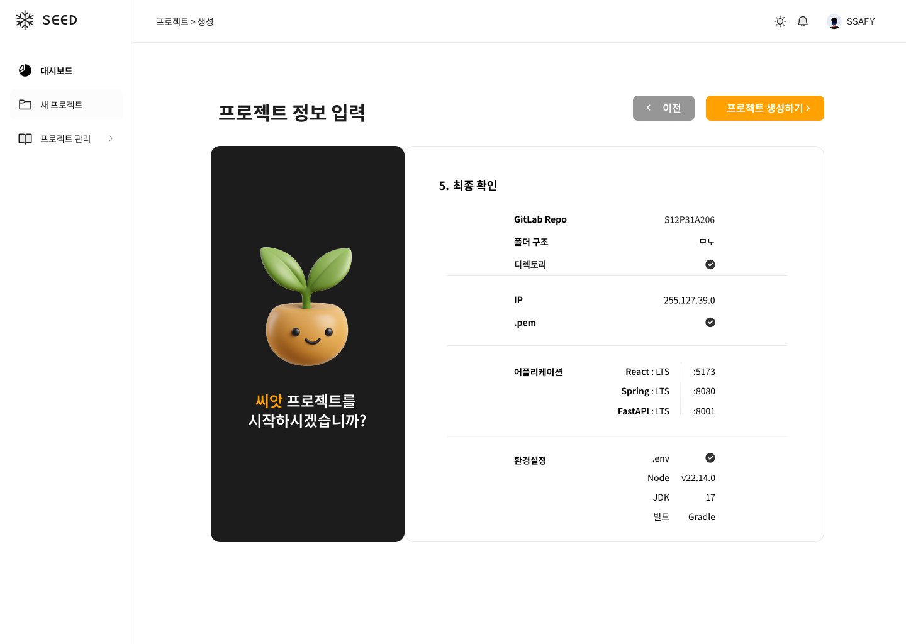
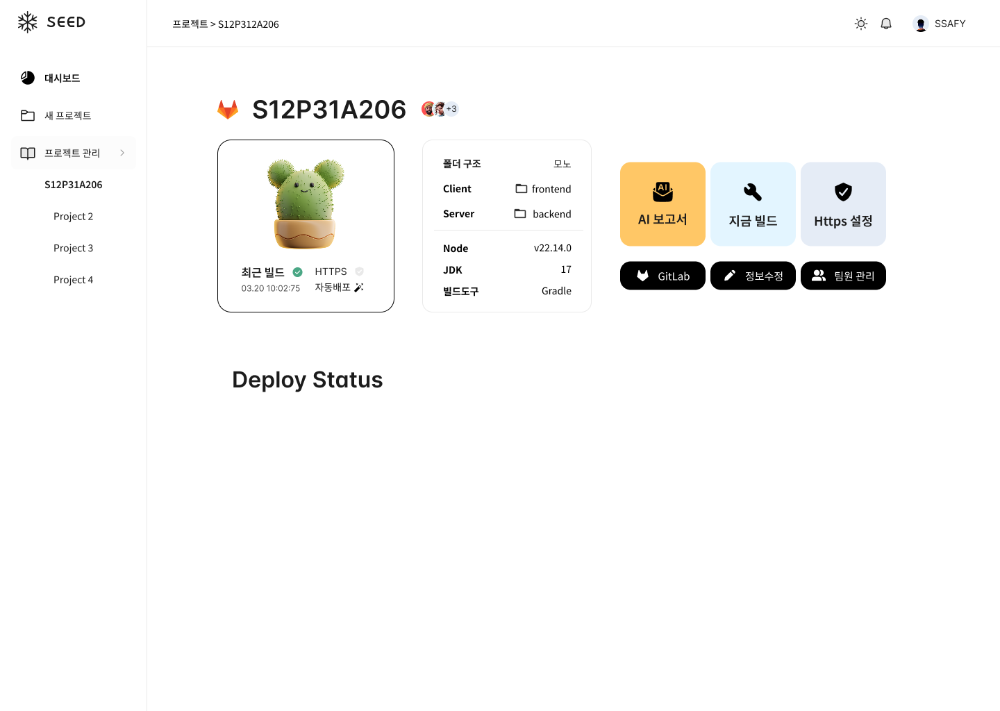
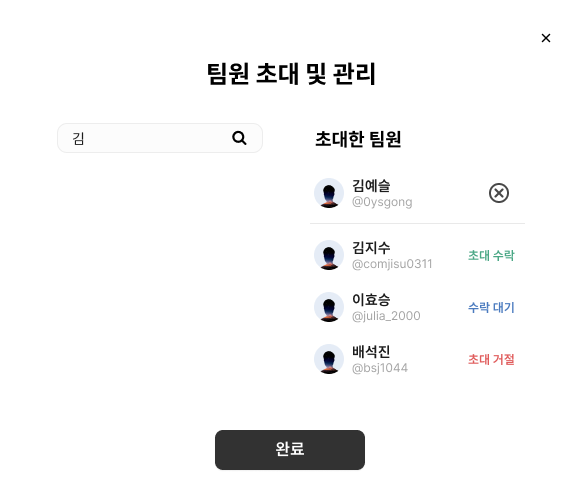

# 250423\_수요일

> ### 목차

1. [피그마 화면 설계](#1-피그마-화면-설계)
2. [지급 교보재 결제 및 등록](#2-지급-교보재-결제-및-등록)

---

### 1. 피그마 화면 설계

- 프로젝트 생성화면 완성



- 프로젝트 상세화면 설계



    - 상세화면 기능 버튼 구성
        - 지금 빌드, Https 설정, AI 보고서, GitLab 바로가기, 정보수정, 팀원관리

- 팀원 관리 및 알람 모달 설계



<br>

```
[] 사용자에게 입력받는 정보를 줄일 수 있는 요소/ 방법 생각해보기
[] 대시보드와 프로젝트 상세에서 겹치는 UI 어떻게 수정할지 생각해보기
```

### 2. 지급 교보재 결제 및 등록

- GPT API Token
- Claude AI Max Plan
- Cursor AI Pro Plan
- Perplexity Pro Plan
- 추가 EC2 계정 생성
