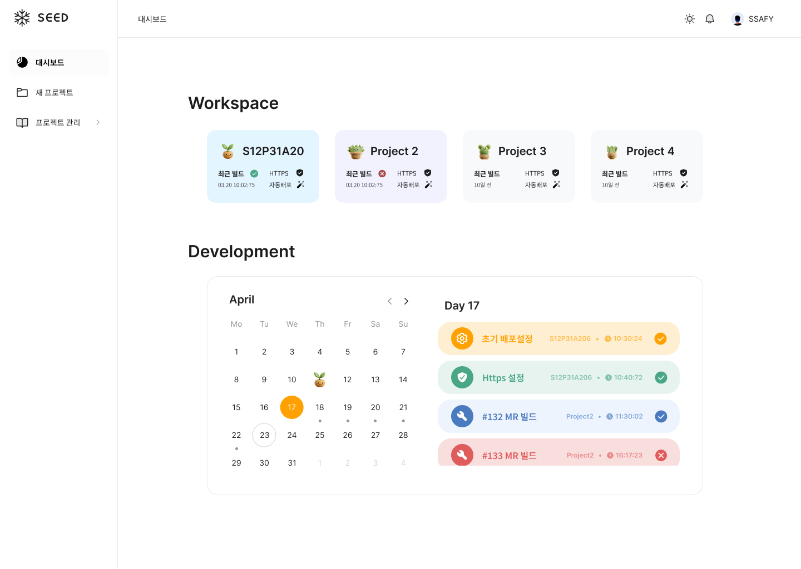

# 250424\_목요일

> ### 목차

1. [피그마 화면 설계 마무리](#1-피그마-화면-설계-마무리)

---

### 1. 피그마 화면 설계 마무리

- 프로젝트 텍스트 스타일 생성 및 적용
- 대시보드 화면 UI 및 내용 수정

  

  - 프로젝트 구분없이 캘린더에 해당 일자에 발생한 이벤트 표시 -> 클릭시 관련 프로젝트 상세 페이지로 이동

- 프로젝트 상세화면 표시 정보 논의
  - 현재 프로젝트의 초기세팅, Https 세팅 및 빌드기록 탭 생성 -> 각 단계 status 표시
  - 빌드 기록: 빌드 성공 여부를 직관적으로 확인하도록 하고, 해당 빌드를 발생시킨 MR 로 이동할 수 있는 버튼 제공

<br>

```
[] 프론트엔드 개발환경 생각해보기 (프레임워크, 라이브러리 등)
[] 초기세팅 준비하기
```
