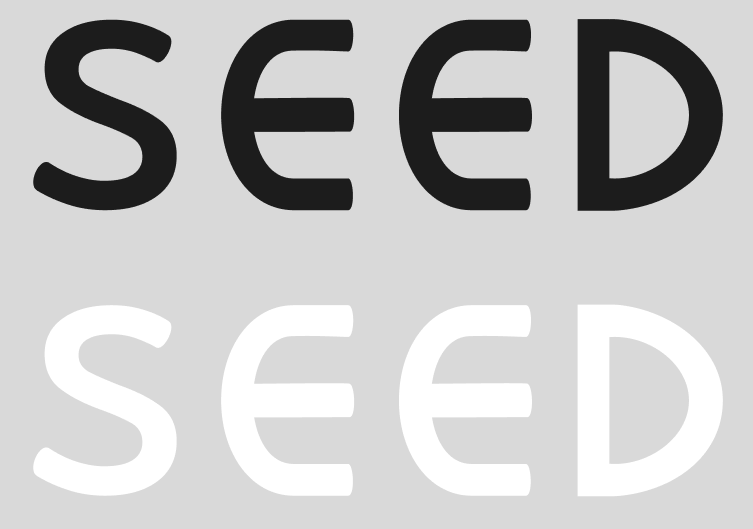
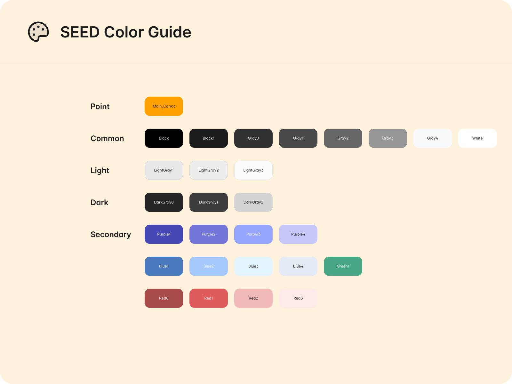
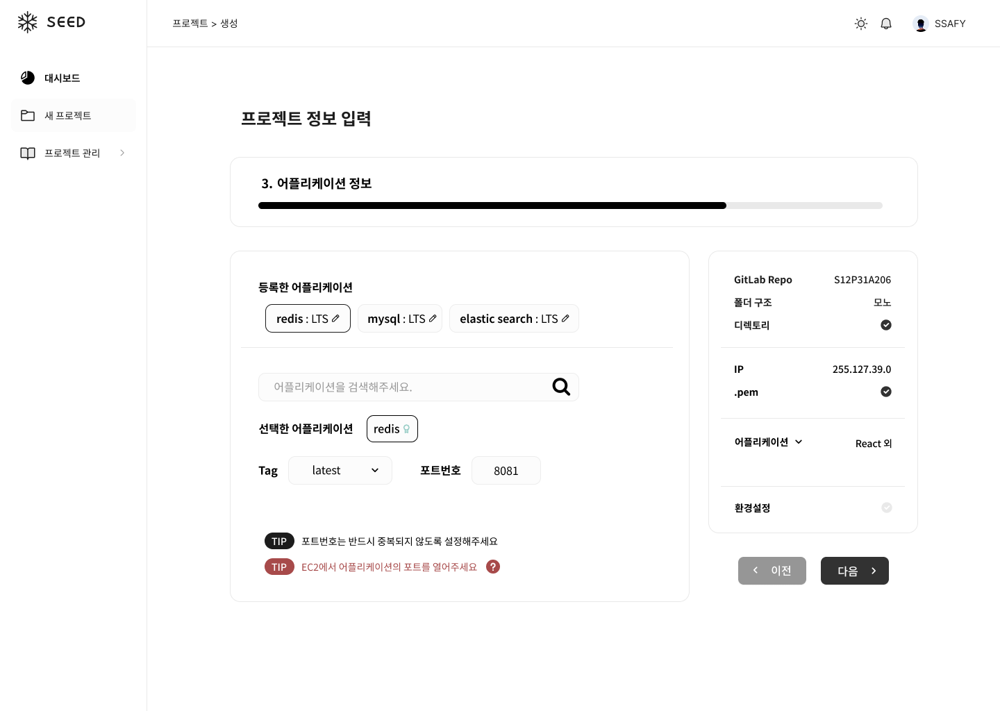
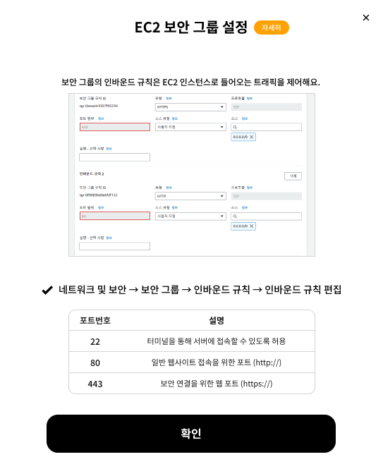

# 250422\_화요일

> ### 목차

1. [피그마 화면 설계](#1-피그마-화면-설계)
2. [프로젝트 생성 API 설계 논의](#2-프로젝트-생성-api-설계-논의-w-백엔드)

---

### 1. 피그마 화면 설계

- 로고 제작
  
- 포인트 컬러 및 색상 스타일 선정
  
- 메인 캐릭터 생성
  

- 개발자 친화적 UI 고려

  - 라이트/ 다크 모드 개발

- 메인 대시보드, 프로젝트 생성화면 구현
  
- 도움말 모달창 생성 및 정확한 정보 확인
  

<br>

```
<더 생각해볼 부분>
[] 사용자의 불편함을 최대한 줄이되 반드시 필요한 프로젝트 정보들 백엔드와 확인하기
[] AI 보고서 어떤 내용을 어떻게 보여주면 좋을 지 생각해보기
```

### 2. 프로젝트 생성 API 설계 논의 (w/ 백엔드)

- 도커 이미지 설정을 위한 검색 방식 논의

- 요청 : 검색어
- 응답 : 이미지 명, 모든 Tag값, default 포트번호
  - 조건 : Docker Official Image
